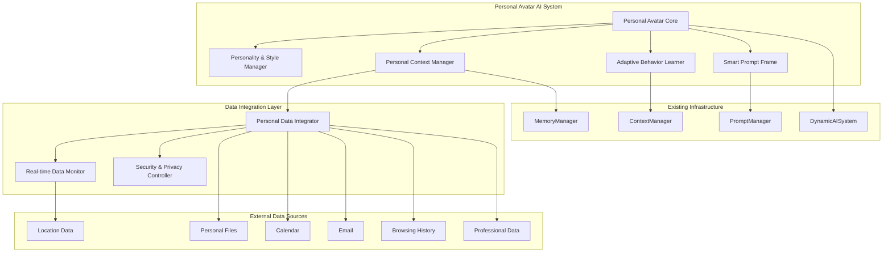
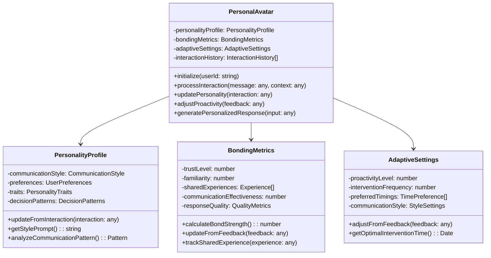
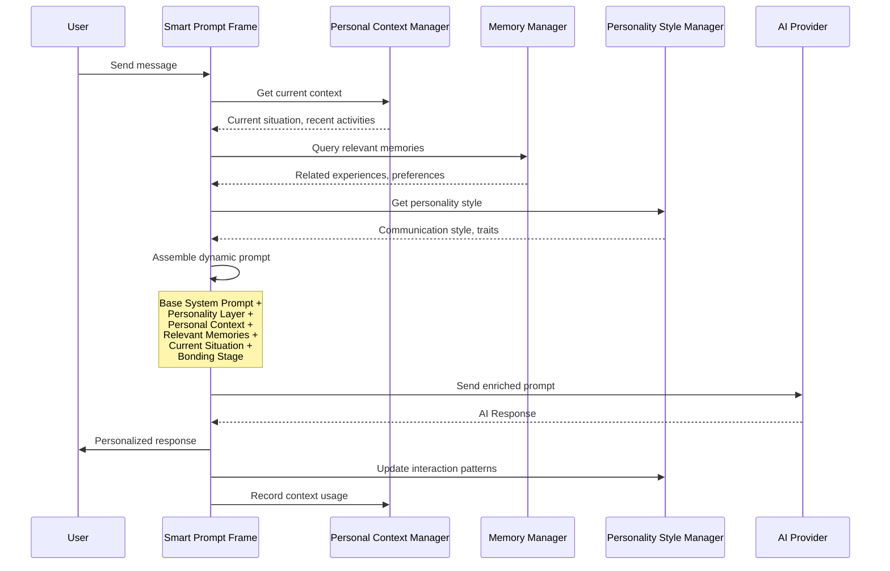
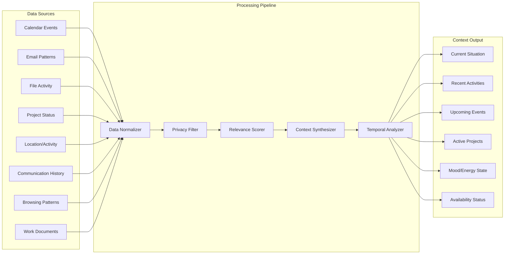
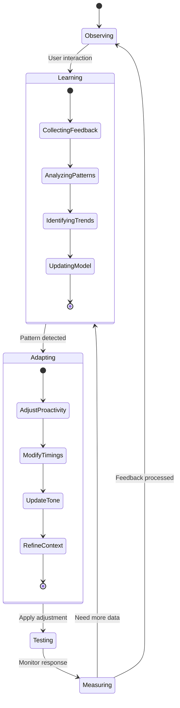
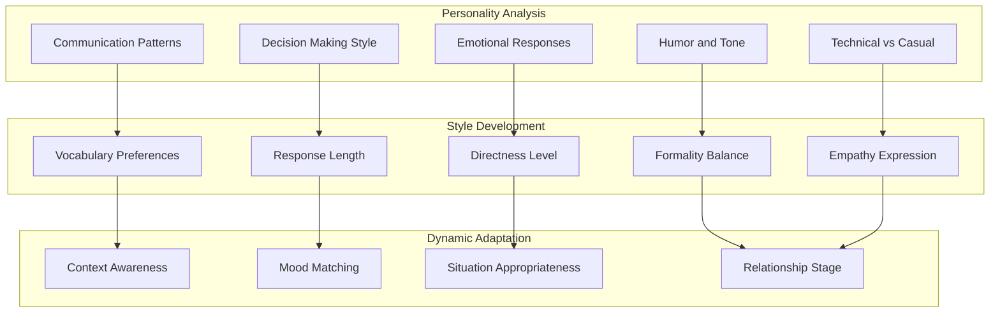
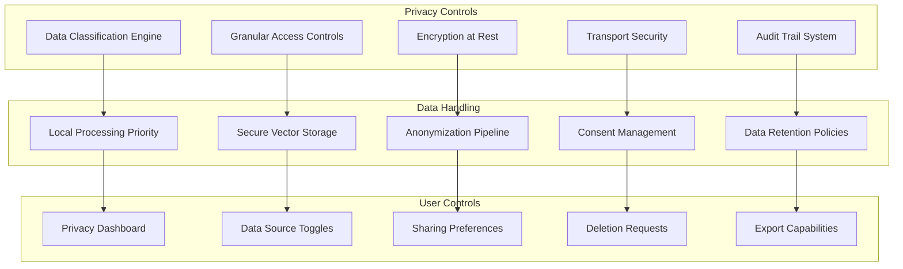

# Personal Avatar AI System - Comprehensive Architectural Design

## Executive Summary

This document outlines the design for a Personal Avatar AI system that creates a deeply personalized, bonding AI companion capable of becoming both a partner and extension of the user. The system leverages existing infrastructure while adding sophisticated personalization, adaptive learning, and privacy-conscious data integration.

## Vision Statement

Create an AI avatar that:
- **Actively bonds** with the user through personalized interactions
- **Develops a unique communication style** that mirrors the user's personality
- **Anticipates needs** by analyzing patterns in schedule, habits, and projects
- **Learns and remembers** personal details, preferences, and experiences
- **Adapts proactivity** based on user feedback and interaction patterns

## System Architecture Overview



## Core Components

### 1. Personal Avatar Core (`src/ai/PersonalAvatar.ts`)

The central orchestrator that manages personality, bonding, and adaptive behavior.



**Key Responsibilities:**
- Orchestrate all avatar subsystems
- Maintain consistent personality across interactions
- Track bonding progression over time
- Adapt behavior based on user feedback
- Generate contextually appropriate responses

### 2. Smart Prompt Frame System (`src/ai/SmartPromptFrame.ts`)

Dynamic context assembly that creates rich, personalized prompts for every interaction.



**Prompt Frame Structure:**
```
SYSTEM PROMPT:
- Base AI capabilities and guidelines
- Personality and communication style directives
- Current relationship stage and bonding level
- Response format and interaction guidelines

PERSONAL CONTEXT:
- Current situation and immediate environment
- Recent activities and ongoing projects
- Upcoming events and commitments
- Mood indicators and activity patterns

MEMORY CONTEXT:
- Relevant past conversations and experiences
- User preferences and decision patterns
- Shared experiences and bonding moments
- Learning progress and adaptation history

SITUATIONAL CONTEXT:
- Time of day and scheduling context
- Location and activity context
- Current focus and attention state
- Interruption appropriateness level
```

### 3. Personal Context Manager (`src/context/PersonalContextManager.ts`)

Securely manages and contextualizes personal data from multiple sources.



**Data Integration Capabilities:**
- **Calendar Integration**: Parse events, meetings, deadlines, and free time
- **Email Analysis**: Communication patterns, sender relationships, content themes
- **File Activity**: Document access patterns, project focus areas
- **Professional Data**: Code repositories, meeting notes, project timelines
- **Real-time Data**: Location, activity, mood indicators (with consent)
- **Browsing History**: Research interests, learning patterns, problem areas

### 4. Adaptive Behavior Learning System (`src/ai/AdaptiveBehaviorLearner.ts`)

Learns and adjusts intervention patterns based on user feedback and interaction success.



**Learning Mechanisms:**
- **Interaction Success Tracking**: Response quality, user engagement, follow-up actions
- **Timing Optimization**: Learn optimal intervention windows based on user activity
- **Proactivity Calibration**: Adjust suggestion frequency based on user receptiveness
- **Communication Style Refinement**: Adapt tone, formality, and approach based on effectiveness
- **Context Relevance Learning**: Improve context selection based on user utilization

### 5. Personality & Style Manager (`src/ai/PersonalityStyleManager.ts`)

Develops and maintains a unique communication style that mirrors the user's personality.



## Implementation Phases

### Phase 1: Foundation Enhancement (Weeks 1-2)

**Extend Existing Infrastructure:**

1. **Memory System Enhancement** (`src/ai/associativeMemory.ts`)
   - Add personality and preference tracking tables
   - Implement interaction pattern storage
   - Create bonding experience memory storage

2. **Context Manager Extension** (`src/context/ContextManager.ts`)
   - Add personal data context types
   - Implement privacy-aware context switching
   - Create contextual data validation

3. **Prompt Manager Enhancement** (`src/managers/PromptManager.ts`)
   - Add dynamic personality injection
   - Implement context-aware prompt assembly
   - Create adaptive response formatting

**File Modifications:**
- Extend [`MemoryManager`](src/ai/associativeMemory.ts) with personality schemas
- Enhance [`PromptManager`](src/managers/PromptManager.ts) with dynamic context injection
- Update [`DynamicAISystem`](src/ai/DynamicAISystem.ts) to support avatar integration

### Phase 2: Core Avatar Implementation (Weeks 3-4)

**New Components:**

1. **Personal Avatar Core** (`src/ai/PersonalAvatar.ts`)
   ```typescript
   interface PersonalAvatarConfig {
     userId: string;
     initialPersonality?: Partial<PersonalityProfile>;
     privacySettings: PrivacySettings;
     adaptationSettings: AdaptationSettings;
   }
   
   class PersonalAvatar extends MultiContextObject {
     private personalityProfile: PersonalityProfile;
     private bondingMetrics: BondingMetrics;
     private adaptiveSettings: AdaptiveSettings;
     
     async initialize(config: PersonalAvatarConfig): Promise<void>;
     async processInteraction(interaction: UserInteraction): Promise<AvatarResponse>;
     async updatePersonality(feedback: InteractionFeedback): Promise<void>;
   }
   ```

2. **Personal Context Manager** (`src/context/PersonalContextManager.ts`)
   ```typescript
   interface PersonalContext {
     currentSituation: SituationContext;
     recentActivities: ActivityContext[];
     upcomingEvents: EventContext[];
     activeProjects: ProjectContext[];
     availabilityStatus: AvailabilityContext;
   }
   
   class PersonalContextManager {
     async gatherCurrentContext(userId: string): Promise<PersonalContext>;
     async integrateDataSource(source: DataSource): Promise<void>;
     async filterPrivacyConstraints(context: PersonalContext): Promise<PersonalContext>;
   }
   ```

### Phase 3: Adaptive Learning (Weeks 5-6)

**Behavior Learning System:**

1. **Adaptive Behavior Learner** (`src/ai/AdaptiveBehaviorLearner.ts`)
   ```typescript
   interface LearningMetrics {
     interactionSuccess: number;
     userSatisfaction: number;
     responseTime: number;
     contextAccuracy: number;
     proactivityEffectiveness: number;
   }
   
   class AdaptiveBehaviorLearner {
     async analyzeInteractionPatterns(interactions: UserInteraction[]): Promise<Pattern[]>;
     async adjustBehaviorModel(feedback: UserFeedback): Promise<BehaviorAdjustment>;
     async optimizeInterventionTiming(userActivity: ActivityPattern[]): Promise<TimingModel>;
   }
   ```

2. **Feedback Processing System** (`src/ai/FeedbackProcessor.ts`)
   - Implicit feedback detection (response time, follow-up actions)
   - Explicit feedback collection and processing
   - Satisfaction scoring and trend analysis

### Phase 4: Advanced Personalization (Weeks 7-8)

**Enhanced Features:**

1. **Predictive Assistance Engine** (`src/ai/PredictiveAssistance.ts`)
   - Anticipate user needs based on patterns
   - Proactive suggestion generation
   - Context-aware assistance timing

2. **Multi-modal Context Integration** (`src/context/MultiModalContext.ts`)
   - Real-time data stream processing
   - Cross-platform data correlation
   - Privacy-preserving data fusion

## Technical Implementation Details

### Data Structures

**Personality Profile:**
```typescript
interface PersonalityProfile {
  communicationStyle: {
    formality: number;        // 0-1 scale
    directness: number;       // 0-1 scale
    empathy: number;          // 0-1 scale
    humor: number;            // 0-1 scale
    technicality: number;     // 0-1 scale
  };
  
  preferences: {
    responseLength: 'brief' | 'moderate' | 'detailed';
    explanationDepth: 'high-level' | 'moderate' | 'detailed';
    proactivityLevel: number; // 0-1 scale
    interruptionTolerance: number; // 0-1 scale
  };
  
  traits: {
    decisionMakingStyle: 'analytical' | 'intuitive' | 'collaborative';
    learningPreference: 'visual' | 'textual' | 'interactive';
    workStyle: 'focused' | 'multitasking' | 'flexible';
  };
  
  adaptationHistory: AdaptationEvent[];
}
```

**Bonding Metrics:**
```typescript
interface BondingMetrics {
  trustLevel: number;                    // 0-1 scale
  familiarity: number;                   // 0-1 scale
  communicationEffectiveness: number;    // 0-1 scale
  sharedExperiences: SharedExperience[];
  interactionQuality: QualityMetrics;
  
  calculateBondStrength(): number;
  updateFromInteraction(interaction: UserInteraction): void;
  getRelationshipStage(): 'introduction' | 'developing' | 'established' | 'deep';
}
```

### Smart Prompt Assembly

**Dynamic Prompt Construction:**
```typescript
class SmartPromptFrame {
  async assemblePersonalizedPrompt(
    userMessage: string,
    context: PersonalContext,
    personality: PersonalityProfile,
    memories: RelevantMemory[]
  ): Promise<EnrichedPrompt> {
    
    const basePrompt = this.getBaseSystemPrompt();
    const personalityLayer = this.buildPersonalityPrompt(personality);
    const contextLayer = this.buildContextPrompt(context);
    const memoryLayer = this.buildMemoryPrompt(memories);
    const relationshipLayer = this.buildRelationshipPrompt(personality.bondingStage);
    
    return {
      system: `${basePrompt}\n\n${personalityLayer}\n\n${relationshipLayer}`,
      context: `${contextLayer}\n\n${memoryLayer}`,
      user: userMessage
    };
  }
  
  private buildPersonalityPrompt(personality: PersonalityProfile): string {
    return `
PERSONALITY DIRECTIVES:
- Communication Style: ${this.formatCommunicationStyle(personality.communicationStyle)}
- Response Preferences: ${this.formatResponsePreferences(personality.preferences)}
- Interaction Approach: ${this.formatInteractionApproach(personality.traits)}
- Adaptation Level: ${personality.adaptationHistory.length} interactions learned from
    `;
  }
}
```

### Privacy and Security Architecture



**Security Features:**
- **End-to-end encryption** for all personal data
- **Local processing** whenever possible to minimize data exposure
- **Granular consent** for each data source and processing type
- **Automatic data classification** (public, personal, sensitive, private)
- **Secure memory storage** using encrypted vector databases
- **Audit logging** for all data access and processing operations

### Integration Points

**Existing Infrastructure Leveraging:**

1. **DynamicAISystem Integration:**
   ```typescript
   // Extend existing system
   class PersonalAvatarAISystem extends DynamicAISystem {
     private personalAvatar: PersonalAvatar;
     
     async initializeWithPersonalAvatar(config: PersonalAvatarConfig) {
       await super.init();
       this.personalAvatar = new PersonalAvatar(config);
       await this.personalAvatar.initialize();
     }
     
     async chat(messages: any[], options: any = {}) {
       const personalContext = await this.personalAvatar.gatherContext();
       const enrichedOptions = { ...options, personalContext };
       return super.chat(messages, enrichedOptions);
     }
   }
   ```

2. **Memory Manager Enhancement:**
   ```typescript
   // Extend existing memory capabilities
   interface PersonalMemorySchema {
     personalityInsights: PersonalityInsight[];
     interactionPatterns: InteractionPattern[];
     bondingMilestones: BondingMilestone[];
     preferenceEvolution: PreferenceChange[];
   }
   
   class PersonalMemoryManager extends MemoryManager {
     async storePersonalityInsight(insight: PersonalityInsight): Promise<void>;
     async queryPersonalityPatterns(query: string): Promise<PersonalityInsight[]>;
     async trackBondingProgression(milestone: BondingMilestone): Promise<void>;
   }
   ```

## Deployment Strategy

### Development Environment Setup

1. **Local Development:**
   - Extend existing Next.js application
   - Add personal data simulation tools
   - Create avatar testing interface
   - Implement privacy-safe development data

2. **Testing Framework:**
   - Personality consistency testing
   - Adaptive learning validation
   - Privacy constraint verification
   - Performance benchmarking

### Production Considerations

1. **Scalability:**
   - Multi-user avatar management
   - Efficient vector similarity search
   - Real-time context processing
   - Background learning processes

2. **Monitoring:**
   - Avatar performance metrics
   - User satisfaction tracking
   - Privacy compliance monitoring
   - System resource utilization

## Success Metrics

### Bonding Effectiveness
- **Trust Level Progression**: Measured through user feedback and interaction patterns
- **Communication Quality**: Response relevance and user satisfaction scores
- **Personalization Accuracy**: Context appropriateness and preference alignment

### Adaptive Learning Performance
- **Prediction Accuracy**: How well the avatar anticipates user needs
- **Intervention Timing**: Optimal proactivity without being intrusive
- **Style Adaptation**: Communication style convergence with user preferences

### Technical Performance
- **Response Time**: Sub-second context assembly and prompt generation
- **Memory Efficiency**: Optimal vector search and storage utilization
- **Privacy Compliance**: Zero data leaks and full audit trail compliance

## Future Enhancements

### Advanced Capabilities
- **Multi-modal Integration**: Voice, visual, and behavioral pattern analysis
- **Collaborative Intelligence**: Working alongside other AI systems and tools
- **Predictive Assistance**: Anticipating needs before explicit requests
- **Emotional Intelligence**: Advanced mood and emotional state understanding

### Platform Extensions
- **Mobile Integration**: Cross-platform personality and context sync
- **IoT Connectivity**: Smart home and device integration for broader context
- **Professional Tools**: Deep integration with development environments and productivity tools

---

## Conclusion

This Personal Avatar AI system represents a sophisticated approach to creating a truly personalized AI companion that grows and adapts with the user. By leveraging existing infrastructure while adding advanced personalization, adaptive learning, and privacy-conscious data integration, the system creates a foundation for an AI that becomes a genuine extension of the user's capabilities and preferences.

The architecture prioritizes privacy, security, and user control while enabling deep personalization and bonding through careful observation, learning, and adaptation. The phased implementation approach ensures steady progress while maintaining system stability and user trust throughout development.